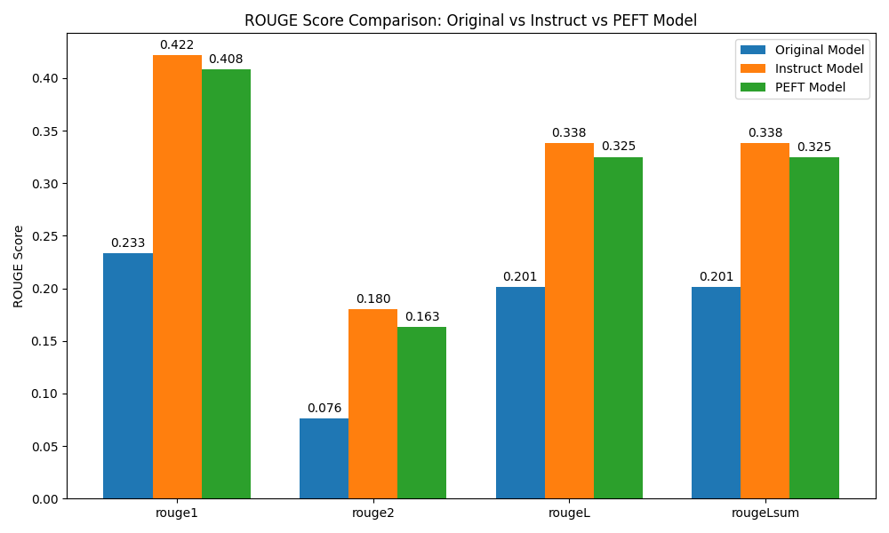
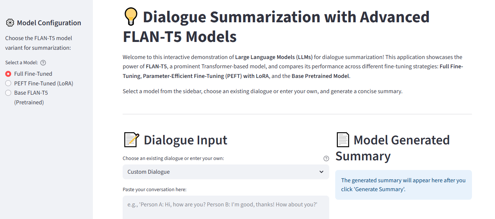
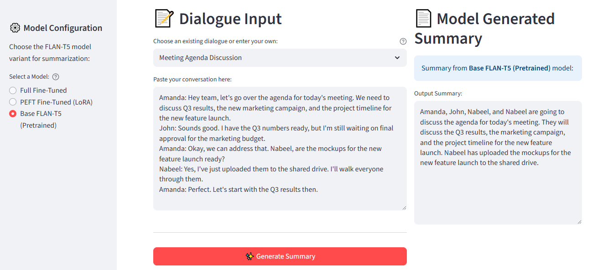
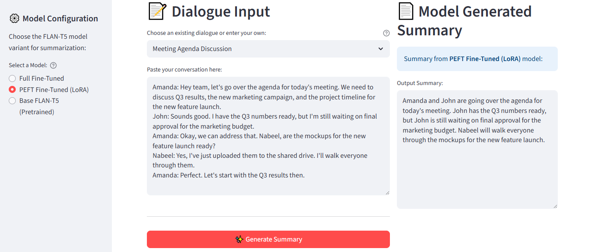
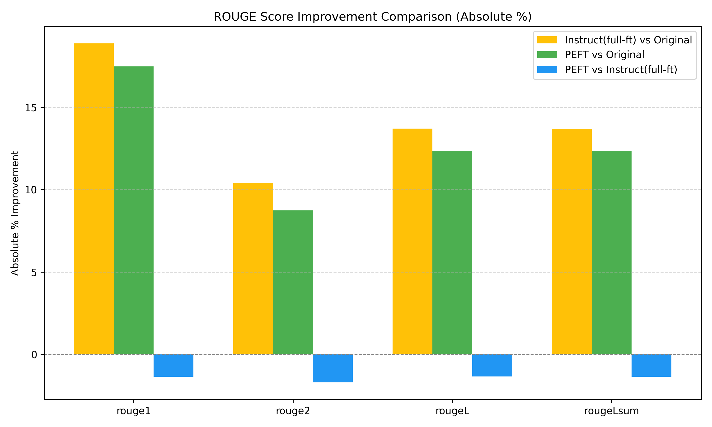

# 💡 Dialogue Summarization with Advanced Fine-Tuning Techniques - **LLMs**  

<p align="center">


</p>

<p align="center">

</p>

---


## 📚 Table of Contents

- [Project Overview](#project-overview)
- [Key Features](#-key-features)
- [Approach & Methodology](#-approach--methodology)
  - [1. In-Context Learning](#1-in-context-learning-zero_one_few_shots_in-contextipynb)
  - [2. Full Fine-Tuning](#2-full-fine-tuning-full_fine_tuneipynb)
  - [3. Parameter-Efficient Fine-Tuning (PEFT)](#3-parameter-efficient-fine-tuning-peft-peft_fine_tuneipynb)
  - [4. Evaluation and Comparison](#4-evaluation-and-comparison-score_compareipynb)
- [Interactive Demo](#interactive-demo)
- [Results & Analysis](#-results--analysis)
  - [ROUGE Score Comparison](#rouge-score-comparison)
  - [Performance Improvement](#performance-improvement)
- [Project Structure](#️-project-structure)
- [Getting Started](#️-getting-started)
  - [Prerequisites](#prerequisites)
  - [Installation](#installation)
- [Creator & Maintainer](#-creator--maintainer)

---

## Project Overview

This project explores and demonstrates dialogue summarization using the **FLAN-T5 Large Language Model (LLM)**. It provides a hands-on comparison of different strategies, from various prompting techniques to advanced fine-tuning methods like **Full Fine-Tuning** and **Parameter-Efficient Fine-Tuning (PEFT)** with **LoRA**.

The primary goal is to illustrate how adapting a general-purpose LLM to a specific downstream task can dramatically improve its performance. The results highlight the trade-offs between computational cost, model size, and performance, providing a clear case study for practical LLM application development.

---


## 🚀 Key Features

- **Dialogue Summarization**: Summarizes conversations using a state-of-the-art LLM.  
- **Prompt Engineering**: Explores and compares zero-shot, one-shot, and few-shot inference techniques.  
- **Full Fine-Tuning**: Demonstrates the traditional fine-tuning approach where all model parameters are updated.  
- **Parameter-Efficient Fine-Tuning (PEFT) with LoRA**: Implements a resource-efficient fine-tuning method that significantly reduces computational cost and memory footprint by only training a small number of new parameters.  
- **Quantitative Evaluation**: Compares the performance of the models using the ROUGE metric.  
- **Interactive Streamlit App**: A user-friendly web application to interactively summarize dialogues using the different fine-tuned models.

---

## 🧠 Approach & Methodology  
This project follows a structured approach to fine-tune the google/flan-t5-base model for dialogue summarization, leveraging the DialogSum dataset.

### 1. In-Context Learning (`zero_one_few_shots_in-context.ipynb`)  
This notebook serves as the baseline, demonstrating how the pretrained FLAN-T5 model performs on dialogue summarization without any specific training.

- **Zero-Shot**: The model is given a direct instruction without any examples.  
- **One-Shot**: A single example of a dialogue-summary pair is provided to guide the model.  
- **Few-Shot**: Multiple examples are provided to better inform the model of the desired output style and format.

### 2. Full Fine-Tuning (`full_fine_tune.ipynb`)  
This approach updates all the parameters of the FLAN-T5 model on the entire DialogSum training dataset.

- **Process**: The model's weights are adjusted through backpropagation for the dialogue summarization task.  
- **Outcome**: This method typically yields the highest performance but is computationally expensive and requires significant memory resources.

### 3. Parameter-Efficient Fine-Tuning (PEFT) (`peft_fine_tune.ipynb`)  
This notebook implements the LoRA (Low-Rank Adaptation) technique to fine-tune the model more efficiently.

- **Process**: Only a small set of new, trainable parameters (the adapter) are introduced, while the original model's weights are kept frozen.  
- **Outcome**: Achieves performance comparable to full fine-tuning with a fraction of the computational cost and storage. This is an ideal method for fine-tuning large models on consumer-grade hardware.

### 4. Evaluation and Comparison (`score_compare.ipynb`)  
The final notebook compares the performance of all models.

- **Metrics**: The ROUGE metric is used to quantitatively assess the quality of the generated summaries against human-written baselines.  
- **Visualization**: Plots are generated to provide a clear visual comparison of ROUGE scores and the performance improvements of fine-tuned models over the original model.


---


## Interactive Demo

The project includes an interactive Streamlit application to demonstrate the differences between the fine-tuning strategies. This allows you to directly compare the quality of the summaries generated by the Base, PEFT, and Full Fine-Tuned models on the same input dialogue.

### App Screenshots
<p align="center">
  
  <br>
  <sub>*The main page of the interactive dialogue summarization application.*</sub>
</p>

### Comparison of Model Outputs
Using the "Meeting Agenda Discussion" as an example, observe how the quality and conciseness of the summaries improve with each fine-tuning strategy.

<p align="center">

<br>
<sub>Summary from the Base FLAN-T5 (Pretrained) model. It contains some factual errors (listing Nabeel twice) and is repetitive, demonstrating its lack of task-specific understanding.</sub>
</p>

<p align="center">

<br>
<sub>Summary from the PEFT Fine-Tuned (LoRA) model. This summary is significantly more accurate and concise. It correctly identifies the key actions and topics, showing how a small number of fine-tuned parameters can dramatically improve performance.</sub>
</p>

<p align="center">

<br>
<sub>Summary from the Full Fine-Tuned model. This output is the most succinct and effective. It captures the core meeting agenda and the next steps with the highest level of clarity, validating the high ROUGE scores from the full fine-tuning approach.</sub>
</p>

---

## 📊 Results & Analysis  
The project demonstrates a clear and measurable performance improvement from fine-tuning.

### ROUGE Score Comparison  

| Model            | ROUGE-1 | ROUGE-2 | ROUGE-L | ROUGE-Lsum |
|------------------|---------|---------|----------|-------------|
| Original Model   | 0.233   | 0.076   | 0.201    | 0.201       |
| Full Fine-Tuned  | 0.422   | 0.180   | 0.338    | 0.338       |
| PEFT (LoRA)      | 0.408   | 0.163   | 0.325    | 0.325       |

**Observation:** Both fine-tuned models show a significant increase in all ROUGE metrics compared to the base model.  
**Conclusion:** Fine-tuning on a specific task greatly enhances a model's ability to perform that task accurately.

<p align="center">  </p>

---

### Performance Improvement  

| Improvement Over...      | ROUGE-1 (Abs. %) | ROUGE-2 (Abs. %) | ROUGE-L (Abs. %) | ROUGE-Lsum (Abs. %) |
|--------------------------|------------------|------------------|------------------|----------------------|
| Full FT vs. Original     | +18.86%          | +10.41%          | +13.70%          | +13.69%              |
| PEFT vs. Original        | +17.47%          | +8.73%           | +12.36%          | +12.34%              |

**Observation:** The PEFT model achieves a performance very close to the fully fine-tuned model, with only a small decrease in metrics.  
**Conclusion:** PEFT is an exceptionally effective and efficient alternative to full fine-tuning, making it a viable solution for adapting large models with limited resources.


---

## 🛠️ Project Structure  
The repository is organized to provide a clear and logical flow from data exploration to model deployment.

```bash
flanT5-summarization-fine-tuning/
├── app/
│   ├── app.py              # Streamlit web application for interactive demo
│   └── utils.py            # Helper functions for loading models and generation
├── assets/
│   ├── rouge_comparison_plot.png   # Bar chart comparing ROUGE scores
│   ├── rouge_improvement_comparison.png # Bar chart of performance improvement
│   ├── rouge_improvements.json   # JSON file with calculated improvements
│   └── rouge_scores.json         # JSON file with ROUGE scores for each model
├── data/
│   └── dialogue-summary-training-results.csv # CSV of all model results on test data
├── models/
│   ├── full_ft/            # Fully fine-tuned FLAN-T5 model
│   └── peft_ft/            # PEFT LoRA adapter for FLAN-T5
├── notebooks/
│   ├── full_fine_tune.ipynb       # Jupyter notebook for Full Fine-Tuning
│   ├── peft_fine_tune.ipynb       # Jupyter notebook for PEFT LoRA Fine-Tuning
│   ├── score_compare.ipynb        # Notebook to plot and analyze ROUGE scores
│   └── zero_one_few_shots_in-context.ipynb # Notebook for in-context learning
├── README.md               # You are here!
└── requirements.txt        # Python dependencies
```

---


## ⚙️ Getting Started  

### Prerequisites  
- Python 3.8+  
- `pip` for package management  

### Installation  

**Clone the repository:**  

```bash
git clone https://github.com/nabeelshan78/flanT5-summarization-fine-tuning.git
cd flanT5-summarization-fine-tuning

```

**Create and activate a virtual environment (recommended):**
```bash
python -m venv venv

# On Windows
venv\Scripts\activate

# On macOS/Linux
source venv/bin/activate
```

**Install the required packages:**
```bash
pip install -r requirements.txt
```

---


## 👨‍💻 Creator & Maintainer

**Nabeel Shan**  
*Software Engineering Student @ NUST Islamabad, Pakistan*  
*Aspiring AI/ML Engineer | Deep Learning & NLP Practitioner*

- Currently specializing in Sequence Models — including RNNs, LSTMs, Attention Mechanisms — and building real-world applications such as Neural Machine Translation (NMT) and LLM-based summarization.
- Passionate about research in AI/ML, open-source contributions, and exploring cutting-edge advancements in Generative AI and NLP.
- Actively seeking meaningful collaborations on projects related to LLMs, PEFT, NLP pipelines, and Machine Learning Engineering.

**Connect with me:**
- [LinkedIn](https://www.linkedin.com/in/nabeelshan)
- [GitHub](https://github.com/nabeelshan78)

---

<div align="center">
  <sub>Designed and developed to demonstrate real-world applications of Large Language Models (LLMs) through practical, hands-on implementation.</sub>
</div>

