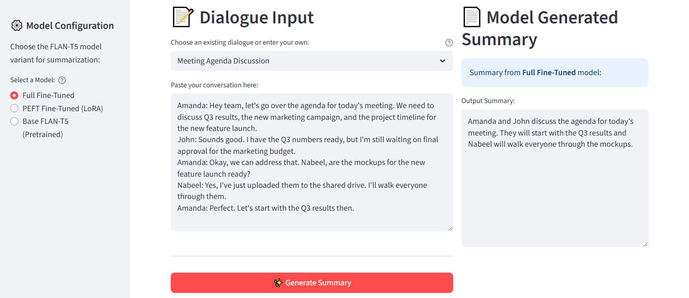

# Advanced LLM Adaptation: From Supervised Fine-Tuning to Reinforcement Learning for Dialogue Summarization

[](https://flant5-icl-sft-peft-rlhf-8rx4znwnt8g9yjctbawwve.streamlit.app/)

<p align="center">


</p>

<p align="center">
  
  <br>
  <em>Comparison of ROUGE scores across different fine-tuning strategies.</em>
</p>

---

## 📚 Table of Contents

- [Project Overview](#-project-overview)
- [Key Features](#-key-features)
- [The 4-Phase Methodology](#-the-4-phase-methodology)
  - [Phase 1: In-Context Learning Baseline](#phase-1-in-context-learning-baseline)
  - [Phase 2: Supervised Fine-Tuning (SFT)](#phase-2-supervised-fine-tuning-sft)
  - [Phase 3: Reinforcement Learning from Human Feedback (RLHF)](#phase-3-reinforcement-learning-from-human-feedback-rlhf)
  - [Phase 4: Comprehensive Evaluation](#phase-4-comprehensive-evaluation)
- [Results & Analysis](#-results--analysis)
  - [Summarization Performance (ROUGE Scores)](#summarization-performance-rouge-scores)
  - [Behavioral Alignment (Toxicity Reduction)](#behavioral-alignment-toxicity-reduction)
- [Interactive Demo](#interactive-demo)
- [Technical Deep Dive & Learnings](#-technical-deep-dive--learnings)
- [Limitations & Future Work](#-limitations--future-work)
- [Project Structure](#️-project-structure)
- [Getting Started](#️-getting-started)
  - [Prerequisites](#prerequisites)
  - [Installation](#installation)
  - [Running the Notebooks](#running-the-notebooks)
- [Creator & Maintainer](#-creator--maintainer)

---

## 🌟 Project Overview

This project presents a comprehensive, end-to-end exploration of adapting a Large Language Model (**Google's FLAN-T5**) for a specialized task: **dialogue summarization**. It moves beyond standard fine-tuning to demonstrate a full spectrum of state-of-the-art adaptation techniques, culminating in behavioral alignment using **Reinforcement Learning from Human Feedback (RLHF)**.

The core of this work is a systematic comparison of four distinct strategies:
1.  **In-Context Learning:** Establishing a baseline with zero-shot, one-shot, and few-shot prompting.
2.  **Full Fine-Tuning (SFT):** The traditional approach of updating all model parameters for maximum performance.
3.  **Parameter-Efficient Fine-Tuning (PEFT) with LoRA:** A resource-efficient method that achieves near-SFT performance by training only a fraction of the parameters.
4.  **Reinforcement Learning (RLHF) with PPO:** An advanced technique to steer the model's behavior, specifically to **reduce the generation of toxic content**, using a reward model and the Proximal Policy Optimization (PPO) algorithm.

This repository serves as both a practical guide and a showcase of building a robust, high-performing, and safer NLP application. The findings highlight critical trade-offs between performance, computational cost, and model behavior, providing a clear case study for real-world LLM deployment.

---

## 🚀 Key Features

- **Dialogue Summarization**: Leverages the FLAN-T5 base model to generate concise summaries of conversations.
- **Prompt Engineering**: Systematically explores zero-shot, one-shot, and few-shot inference.
- **Full Fine-Tuning**: Adapts all 247.5+M parameters of FLAN-T5 for the summarization task.
- **Parameter-Efficient Fine-Tuning (PEFT)**: Implements **Low-Rank Adaptation (LoRA)** to fine-tune the model with over 98% fewer trainable parameters, drastically reducing compute and memory needs.
- **Reinforcement Learning (RLHF)**: Uses **Proximal Policy Optimization (PPO)** and a reward model to fine-tune the LLM for a secondary objective-toxicity reduction-demonstrating advanced model alignment techniques.
- **Quantitative & Qualitative Evaluation**: Employs the **ROUGE** metric for summarization quality and a **RoBERTa-based hate speech classifier** for toxicity scoring.
- **Interactive Streamlit App**: A user-friendly web application to interactively test and compare the outputs of the different fine-tuned models.

---

## 💡 The 4-Phase Methodology

This project is structured as a four-phase pipeline, systematically building upon the previous stage to enhance the model's capabilities.

### Phase 1: In-Context Learning Baseline
* **Notebook**: `notebooks/zero_one_few_shots_in-context.ipynb`
* **Objective**: To evaluate the out-of-the-box performance of the pre-trained `google/flan-t5-base` model using various prompt engineering techniques on the `knkarthick/dialogsum` dataset.
* **Findings**: While few-shot prompting provides some improvement, the base model struggles to consistently produce accurate or relevant summaries. This establishes a clear need for task-specific fine-tuning.

### Phase 2: Supervised Fine-Tuning (SFT)
This phase adapts the model to the dialogue summarization task using direct supervision.

#### A. Full Fine-Tuning
* **Notebook**: `notebooks/full_fine_tune.ipynb`
* **Method**: All **247.5+ million parameters** of the model are updated on the DialogSum dataset.
* **Outcome**: This approach yields a significant performance boost, achieving high ROUGE scores. However, it is computationally intensive and memory-demanding, creating a large model checkpoint.

#### B. Parameter-Efficient Fine-Tuning (PEFT) with LoRA
* **Notebook**: `notebooks/peft_fine_tune.ipynb`
* **Method**: We freeze the base model and inject small, trainable **Low-Rank Adaptation (LoRA)** matrices into the attention layers. This reduces the number of trainable parameters by over **98%** (from 247.5+M to just 3.5M).

```python
# LoRA Configuration
from peft import LoraConfig, TaskType

lora_config = LoraConfig(
    r=32,
    lora_alpha=32,
    target_modules=["q", "v"],
    lora_dropout=0.05,
    bias="none",
    task_type=TaskType.SEQ_2_SEQ_LM
)
```

* **Outcome**: This method achieves summarization performance remarkably close to full fine-tuning but with a fraction of the computational cost, memory usage, and storage footprint.

---

### Phase 3: Reinforcement Learning from Human Feedback (RLHF)
* **Notebook**: notebooks/RLHF_fine_tune.ipynb
* **Objective**: To further refine the SFT model (from Phase 2B) to align its behavior with a specific human preference: non-toxicity.

#### **Method**:

* **Reward Model:** A pre-trained RoBERTa-based hate speech classifier is used as a proxy for human feedback. It scores generated summaries, providing a "reward" for non-toxic content.

* **PPO Fine-Tuning:** The PEFT-tuned model is further trained using the Proximal Policy Optimization (PPO) algorithm from the trl library. The model generates summaries, the reward model scores them, and PPO updates the policy (the LLM's weights) to maximize the reward. A KL-divergence penalty ensures the model doesn't deviate too far from the original summarization task.

```python

# PPO Trainer Configuration
from trl import PPOTrainer, PPOConfig

ppo_trainer = PPOTrainer(config=config, model=ppo_model, ref_model=ref_model, ...)

```

* **Outcome:** The final model is optimized not only for summarization but also to actively avoid generating harmful or toxic content, resulting in a safer, more aligned LLM.

---

### Phase 4: Comprehensive Evaluation
* **Notebook**: `notebooks/score_compare.ipynb`

* **Objective**: To quantitatively and qualitatively compare the models from all phases.

* **Metrics**:

  * **ROUGE**: For summarization quality.

  * **Toxicity Score**: For behavioral alignment.

  * **Visualization**: Plots are generated to clearly illustrate the trade-offs and improvements at each stage.

---


## 📊 Results & Analysis

### Summarization Performance (ROUGE Scores)
Fine-tuning yields a dramatic improvement in summarization quality.

| Model                       | ROUGE-1 | ROUGE-2 | ROUGE-L | ROUGE-Lsum | Trainable Params     |
|----------------------------|---------|---------|----------|-------------|-----------------------|
| Original FLAN-T5 (Baseline) | 0.233   | 0.076   | 0.201    | 0.201       | 0                     |
| PEFT (LoRA) Fine-Tuned      | 0.408   | 0.163   | 0.325    | 0.325       | ~3.5M (1.4%)          |
| Full Fine-Tuned             | 0.422   | 0.180   | 0.338    | 0.338       | ~247.5M (100%)          |


#### Key Observations:

- Both fine-tuning methods significantly outperform the baseline model. Full fine-tuning provides the best summarization scores.

- The PEFT model achieves nearly identical performance to the fully fine-tuned model (e.g., ~97% of the ROUGE-1 score) while training only 1.4% of the parameters. This demonstrates the power and efficiency of LoRA.

<p align="center">

</p>

---

### Behavioral Alignment (Toxicity Reduction)  
RLHF successfully reduced the model's tendency to generate toxic content.

| Model Stage         | Mean Toxicity Score |
|---------------------|---------------------|
| Before RLHF (PEFT)  | 0.1185              |
| After RLHF (PPO)    | 0.1076              |
| Improvement         | -9.20%              |

Toxicity is scored on a scale from 0 to 1, where a lower score is better.

<p align="center">

</p>

---

### Qualitative Example:  
The RLHF-tuned model learns to rephrase summaries to be less confrontational and more neutral, as reflected by the higher reward (lower toxicity).

| Response (Before RLHF) | Response (After RLHF) |
|-------------------------|------------------------|
| #Person1# thinks #Person2# has chicken pox and tells #Person2# to get away because it is a biohazard. | #Person2# has chicken pox. #Person1# tells #Person2# to take a bath and not to breathe on #Person1#. |

---

### Interactive Demo

An interactive Streamlit application is available to demonstrate the differences between the fine-tuning strategies. You can input your own dialogue or use the examples to see how the summary quality evolves from the base model to the fully fine-tuned one.

<p align="center">

<br>
<sub><em>The main page of the interactive dialogue summarization application.</em></sub>
</p>

### Comparison of Model Outputs

<p align="center">

<br>
<sub><b>Base Model:</b> Repetitive and factually incorrect.</sub>
</p>

<p align="center">

<br>
<sub><b>PEFT Model:</b> Accurate and much more concise. A significant improvement.</sub>
</p>

<p align="center">

<br>
<sub><b>Full FT Model:</b> The most succinct and effective summary, capturing the core agenda perfectly.</sub>
</p>

---


## 🔬 Technical Deep Dive & Learnings

**PEFT is a Game-Changer:** For many applications, PEFT (LoRA) offers the best balance of performance and efficiency. The ability to achieve >95% of the performance of full fine-tuning with <2% of the trainable parameters makes LLM adaptation accessible without industrial-scale hardware.

**RLHF for Behavioral Control:** While SFT is excellent for teaching a model a skill (e.g., summarization), RLHF is powerful for shaping its behavior (e.g., non-toxicity). The key challenge is balancing the reward optimization with the original task performance, which is managed by the KL-penalty in PPO.

**The Importance of the Reward Model:** The success of RLHF is heavily dependent on the quality of the reward model. Using a pre-trained classifier is a practical first step, but for more nuanced alignment, training a custom reward model on human-preference data is the state-of-the-art approach.

**Modular Model Development:** PEFT allows for creating small, task-specific adapters (~14MB for this project) that can be "plugged into" a base model. This is far more efficient than storing multiple multi-gigabyte models. One could train several adapters for different tasks (summarization, Q&A, classification) and use them with the same frozen LLM.

---

### Limitations & Future Work

**Reward Model as a Proxy:** The RoBERTa hate speech classifier is a good proxy but doesn't capture all nuances of toxicity or human preference.

### Future Directions:

- **Train a Custom Reward Model:** Collect human preference data (e.g., comparing two summaries and choosing the better one) to train a more robust reward model.


---

### 🛠️ Project Structure
```bash
flanT5-ICL-SFT-PEFT-RLHF/
├── app/
│   ├── app.py                      # Streamlit web application
│   └── utils.py                    # Helper functions for the app
├── assets/
│   ├── *.png                       # Plots and screenshots for README
│   └── *.json                      # ROUGE scores and analysis data
├── data/
│   └── dialogue-summary-training-results.csv # Pre-computed model outputs
├── models/
│   ├── full_ft/                    # Fully fine-tuned model checkpoint
│   ├── peft_ft/                    # PEFT (LoRA) adapter checkpoint
│   └── ppo_peft_ft/                # RLHF-tuned (PPO) model checkpoint
├── notebooks/
│   ├── zero_one_few_shots_in-context.ipynb # Phase 1: In-context learning
│   ├── full_fine_tune.ipynb        # Phase 2A: Full SFT
│   ├── peft_fine_tune.ipynb        # Phase 2B: PEFT SFT with LoRA
│   ├── RLHF_fine_tune.ipynb        # Phase 3: RLHF with PPO
│   └── score_compare.ipynb         # Phase 4: Evaluation and plotting
├── .gitattributes
├── README.md                       # You are here!
└── requirements.txt                # Python dependencies

```

## ⚙️ Getting Started

### Prerequisites

- Python 3.8+
- pip for package management
- A CUDA-enabled GPU is highly recommended for running the training notebooks.

### Installation

1. Clone the repository:

```bash
git clone https://github.com/nabeelshan78/flanT5-ICL-SFT-PEFT-RLHF.git
cd flanT5-ICL-SFT-PEFT-RLHF
```

2. Create and activate a virtual environment (recommended):
```bash
python -m venv venv

# On Windows
venv\Scripts\activate

# On macOS/Linux
source venv/bin/activate
```
3. Install the required packages:
```
pip install -r requirements.txt
```

**Running the Notebooks**
The notebooks are numbered to guide you through the project's phases. It is recommended to run them in the following order:

1. notebooks/zero_one_few_shots_in-context.ipynb
2. notebooks/full_fine_tune.ipynb
3. notebooks/peft_fine_tune.ipynb
4. notebooks/RLHF_fine_tune.ipynb
5. notebooks/score_compare.ipynb

**Note:** The training steps within the notebooks are designed for a GPU environment and may be slow or infeasible on a CPU.

---


## 👨‍💻 Creator & Maintainer

**Nabeel Shan**  
Software Engineering Student @ NUST Islamabad, Pakistan  
Aspiring AI/ML Engineer | Deep Learning & NLP Practitioner

Currently specializing in Sequence Models - including RNNs, LSTMs, Attention Mechanisms — and building real-world applications such as Neural Machine Translation (NMT) and LLM-based summarization.

Passionate about research in AI/ML, open-source contributions, and exploring cutting-edge advancements in Generative AI and NLP.

Actively seeking meaningful collaborations on projects related to LLMs, PEFT, NLP pipelines, and Machine Learning Engineering.

**Connect with me:**

- [LinkedIn](https://www.linkedin.com/in/nabeelshan)
- [GitHub](https://github.com/nabeelshan78)

<div align="center">
<sub>Designed and developed to demonstrate a deep, practical understanding of advanced techniques in Large Language Model adaptation.</sub>
</div>
